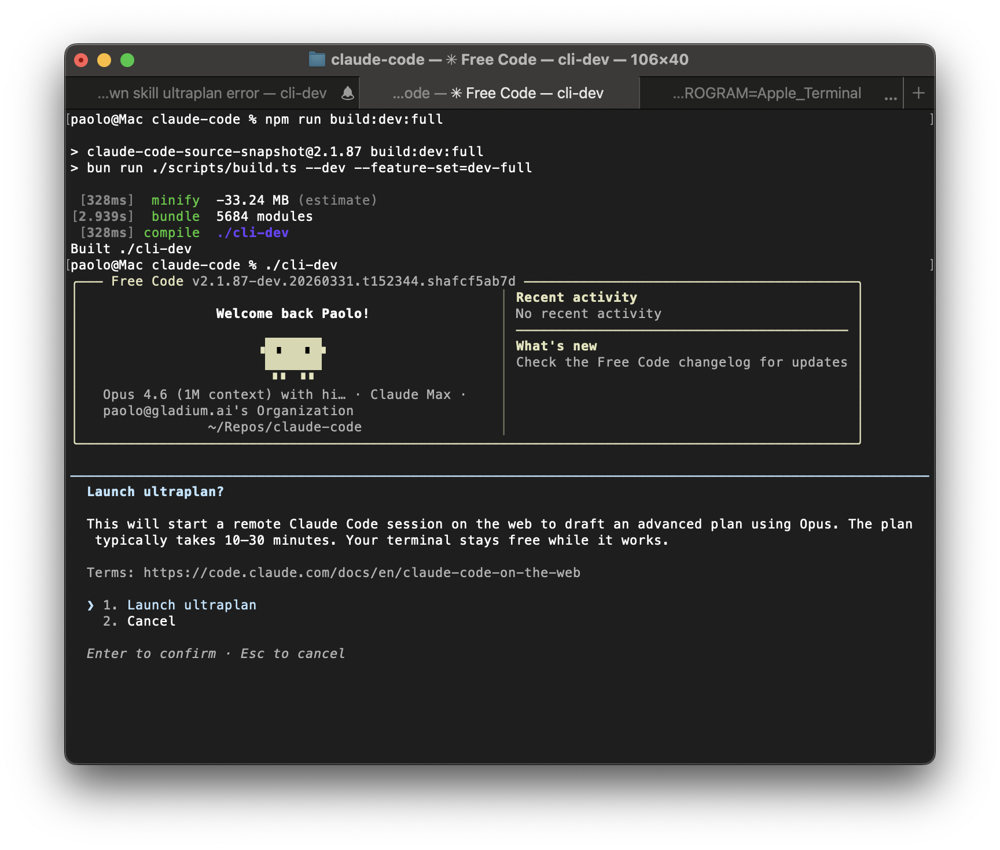

<p align="center">
  
</p>

<h1 align="center">free-fix</h1>

<p align="center">
  <strong>A fork of free-code focused on fixing abnormal token usage.</strong><br>
  Prompt-cache stability fixes, lower prompt churn, stripped telemetry, unlocked experimental features.
</p>

---

## What is this

This repository is a fork of [paoloanzn/free-code](https://github.com/paoloanzn/free-code).

This fork builds on top of `paoloanzn/free-code`. Thanks to Paolo for the original fork and the groundwork that made this project possible.

The main reason this fork exists is simple:

> `paoloanzn/free-code` をベースにした、クリーンでビルド可能な fork で、最近の Claude Code ビルドで報告されている異常なトークン消費の問題にもパッチを当てています。

In English:

> A clean, buildable fork of `paoloanzn/free-code` that also patches the abnormal token overconsumption issues reported in recent Claude Code builds.

This fork is meant for people who liked `free-code`, but found that usage could still drain too quickly in real sessions.

---

## Why this fork exists

Recent Claude Code builds have shown a class of problems where token usage becomes noticeably higher than the visible conversation would suggest.

In practice, that usually means one or more of the following:

- prompt cache continuity gets broken across resume or process boundaries
- client-authored prompt attachments are re-injected when they should have been suppressed
- stable guidance gets added more often than necessary, inflating input size turn after turn

The tool still works, which makes the problem easy to miss. What you notice instead is that usage drops too fast.

This fork focuses on reducing that waste while keeping the CLI broadly compatible with the `free-code` direction.

---

## What this fork changes

This repository keeps the broader `free-code` style, but adds targeted changes aimed at prompt stability and lower token burn.

### Token overconsumption fixes

The main work in this fork is around prompt-cache stability and repeated prompt injection.

Current changes include:

- Persisting resume-relevant attachment state so resumed sessions do not forget what was already announced.
- Preserving prompt-cache control-plane attachments such as deferred tool deltas, agent listing deltas, and MCP instruction deltas.
- Preserving resume and throttle state used for skills, memories, plan mode, auto mode, todo reminders, and task reminders.
- Reducing repeated prompt churn from IDE context attachments when the selected lines or opened file have not changed.
- Removing redundant prompt injections such as duplicated output-style guidance.
- Disabling the native attestation placeholder path by default in external builds, because it touches request serialization and was a plausible source of cache instability.

The goal is not to change model behavior. The goal is to stop spending tokens on bytes the model has effectively already seen.

### Other changes inherited from free-code

This fork also keeps the broader modifications that made `free-code` attractive in the first place:

- telemetry stripped or stubbed
- prompt-level guardrails removed
- experimental feature flags unlocked
- local buildability preserved

### CLI aliases

This fork installs both `free-fix` and `free-code` as entrypoints to the same binary.

If you already use `free-code`, you can keep doing that.
If you want an explicit name for the patched build, use `free-fix`.

---

## Quick Install

macOS / Linux:

```bash
curl -fsSL https://raw.githubusercontent.com/mikumiku-jp/free-fix/main/install.sh | bash
```

Windows PowerShell:

```powershell
irm https://raw.githubusercontent.com/mikumiku-jp/free-fix/main/install.ps1 | iex
```

The installer:

- checks your system
- installs Bun if needed
- clones the repo
- builds the binary
- symlinks `free-fix` and `free-code` into your PATH

After installation:

```bash
free-fix
```

Then authenticate with `/login`.

---

## Build From Source

```bash
git clone https://github.com/mikumiku-jp/free-fix.git
cd free-fix
bun run build
./cli
```

Useful commands:

- `bun run build`
- `bun run build:dev`
- `bun run build:dev:full`
- `bun run compile`

---

## Upstream README

This README is intentionally focused on what is different in this fork.

If you want the broader project overview, provider setup, feature explanations, and the original `free-code` positioning, read the upstream README here:

https://github.com/paoloanzn/free-code/blob/main/README.md

That is the right place to look for general project details.

---

## Current Position

This fork should be understood as:

- a practical fork of `free-code`
- focused on reducing abnormal token usage
- still evolving as more prompt-churn sources are identified

It improves the situation substantially, but it should not be read as a guarantee that every remaining usage anomaly has been eliminated.

---

## Notes

- The original Claude Code source was publicly exposed via npm-distributed source maps, and `free-code` turned that snapshot into a buildable public fork.
- This repository builds on top of that work rather than replacing it.
- If you are comparing behavior, treat `paoloanzn/free-code` as the functional baseline and this fork as the cost-stability-focused variant.

---

## License

The original Claude Code source is the property of Anthropic.
This fork exists because the source was publicly exposed through their npm distribution.
Use at your own discretion.
